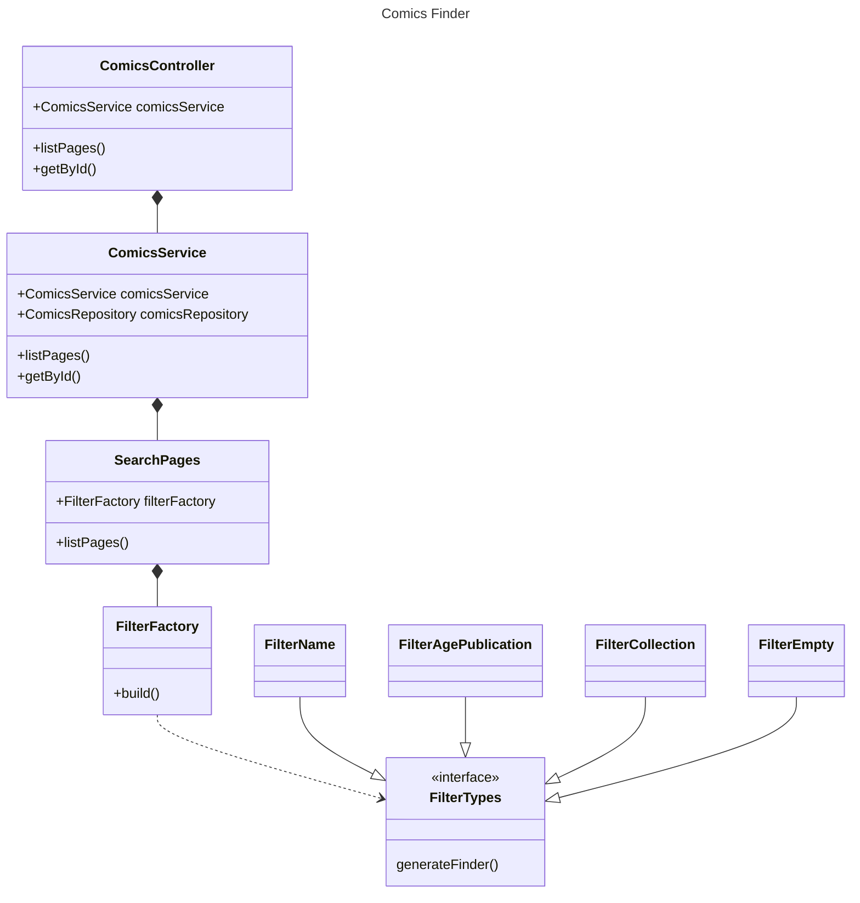
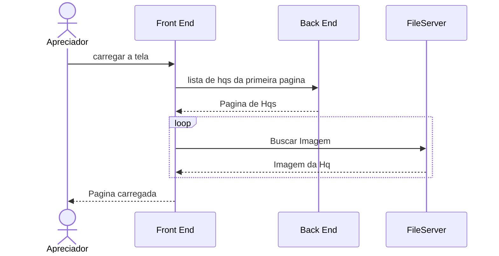
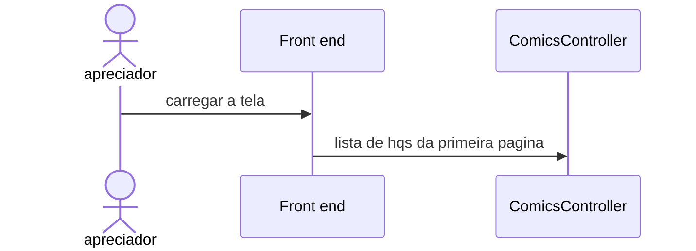

# Projeto integrador

## Requisitos para execução do projeto

* Node: 20.x
* NPM: 10.x
* Servidor Minio ou AWS S3 para armazenamento de imagens
* Autenticação via [AUTH0](https://auth0.com/?utm_content=latamengbrazilbrandauth0-purebrand-home&utm_source=google&utm_campaign=amer_latam-pt_bra_all_ciam-all_dg-ao_auth0_search_google_text_kw_eng-brand_utm2&utm_medium=cpc&utm_id=aNK4z000000UCvOGAW&gad_source=1&gclid=Cj0KCQjw1qO0BhDwARIsANfnkv-MJ484qNBJPtO294ET1v7C0AiKTsUNHCeF-QRvDmwFwOxxiYLcmm0aApYpEALw_wcB)

## Execuções

Modo desenvolvimento: npm run start:dev

rota para acesso as apis: http://localhost:8080/api-docs

## Arquitetura

### Busca de Hqs

#### Diagrama de Classe 

#### Diagrama de Sequência 

